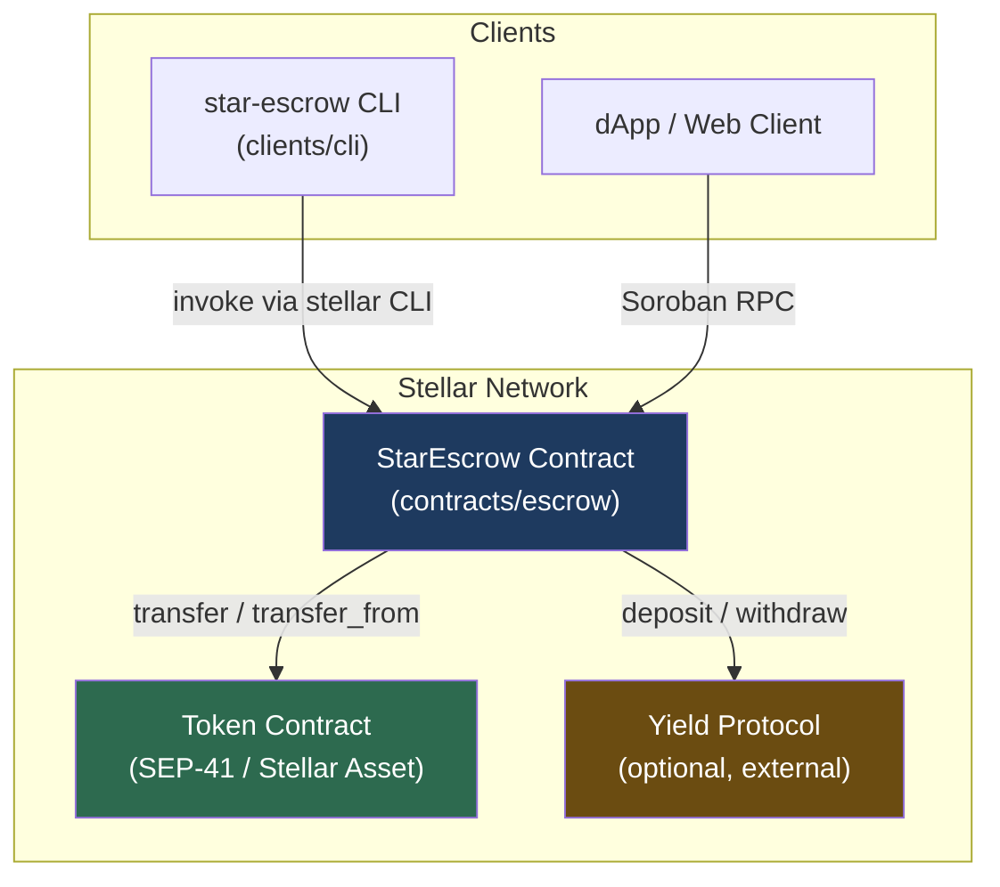
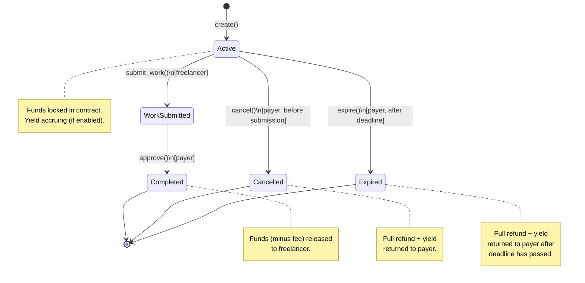
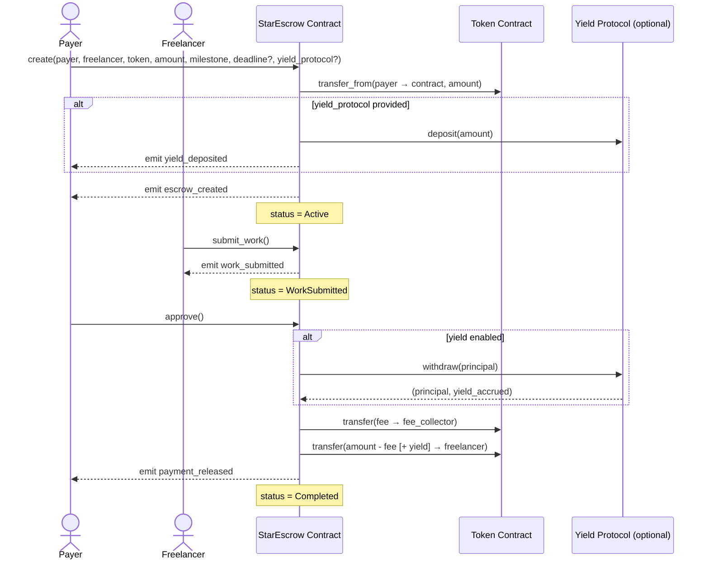
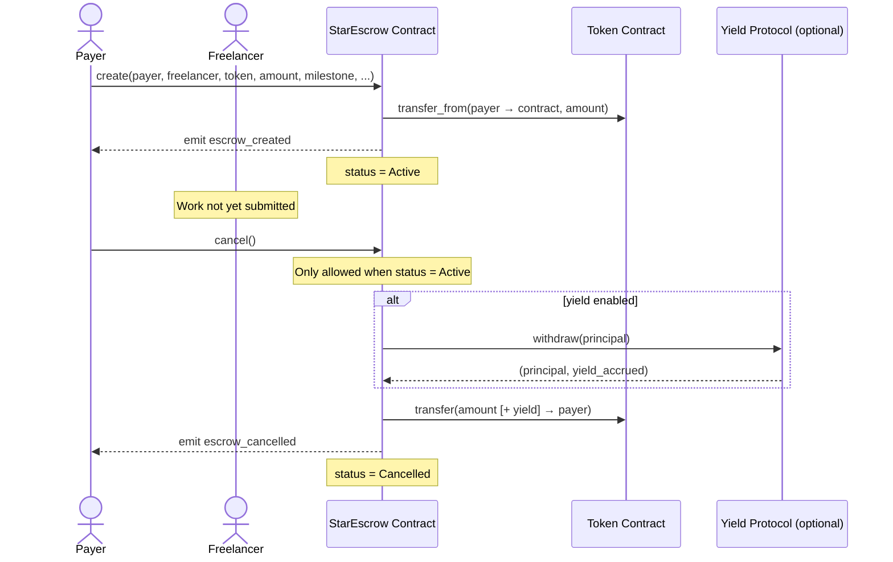
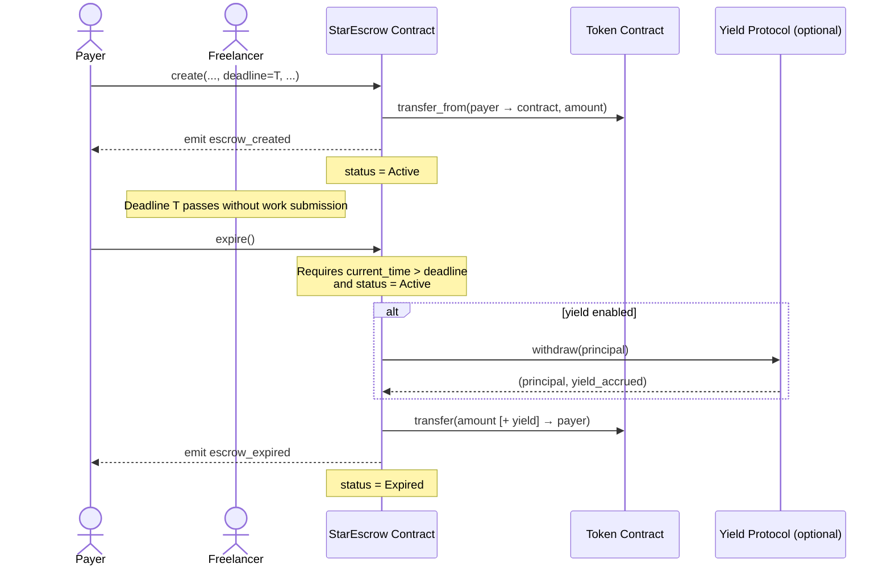

# StarEscrow

[](https://github.com/henry-peters/StarEscrow/actions/workflows/ci.yml)
[](LICENSE)

StarEscrow is a programmable escrow protocol for freelance and marketplace payments on the Stellar network, built with Soroban smart contracts. It locks funds on-chain when a job is created, optionally routes them through a yield protocol while work is in progress, and releases payment to the freelancer upon payer approval — or refunds the payer on cancellation or deadline expiry. A configurable fee (in basis points) is deducted from the released amount and forwarded to a fee collector address.

## Architecture

### Component Diagram



### State Machine



---

## Sequence Diagrams

### Happy Path



### Cancel Flow



### Expire Flow



---

## Documentation

- [Protocol Specification](docs/PROTOCOL.md) — States, transitions, functions, events, and security model
- [Deployment Guide](docs/DEPLOYMENT.md) — Build, deploy to testnet and mainnet, post-deployment checks
- [Security & Threat Model](docs/SECURITY.md) — Trusted parties, attack vectors, mitigations, and out-of-scope threats
- [Changelog](CHANGELOG.md) — Version history and notable changes

---

## Quick Start

### Prerequisites

- [Rust](https://www.rust-lang.org/tools/install) with `wasm32-unknown-unknown` target
- [Stellar CLI](https://developers.stellar.org/docs/tools/developer-tools/cli/stellar-cli) (`stellar`)

### CLI Installation

The StarEscrow CLI (`star-escrow`) provides a convenient interface for interacting with the escrow contract.

#### Build from Source

1. Clone the repository:
   ```bash
   git clone https://github.com/henry-peters/StarEscrow.git
   cd StarEscrow
   ```

2. Build the CLI in release mode:
   ```bash
   cargo build --release -p cli
   ```

3. The binary will be located at:
   ```bash
   ./target/release/star-escrow
   ```

4. (Optional) Install it to your PATH:
   ```bash
   # Linux/macOS
   cp ./target/release/star-escrow /usr/local/bin/
   
   # Or using cargo install (if you have cargo-install)
   cargo install --path clients/cli
   ```

#### Prerequisites for CLI

- [Rust](https://www.rust-lang.org/tools/install) (latest stable version)
- [Stellar CLI](https://developers.stellar.org/docs/tools/developer-tools/cli/stellar-cli) (for contract interactions)

#### Verify Installation

After building, verify the CLI is working:

```bash
./target/release/star-escrow --help
```

You should see usage information for all available commands.

### Build

```bash
stellar contract build
```

### Test

```bash
cargo test -p escrow
```

### Deploy

See [docs/DEPLOYMENT.md](docs/DEPLOYMENT.md) for full instructions.

## Usage

Set required environment variables:

```bash
export ESCROW_CONTRACT_ID=<contract-id>
export ADMIN_SECRET=<admin-secret-key>
export PAYER_SECRET=<payer-secret-key>
export FREELANCER_SECRET=<freelancer-secret-key>
```

Initialize the protocol (admin, one-time):

```bash
star-escrow init \
  --fee-bps 100 \
  --fee-collector <fee-collector-address>
```

Create an escrow and lock funds:

```bash
star-escrow create \
  --freelancer <freelancer-address> \
  --token <token-address> \
  --amount 1000000000 \
  --milestone "Deliver final design assets" \
  --deadline 1800000000
```

Freelancer submits work, payer approves:

```bash
star-escrow submit-work
star-escrow approve
```

Cancel before work is submitted (payer only):

```bash
star-escrow cancel
```

Run `star-escrow --help` for the full command reference.

## License

This project is licensed under the [MIT License](LICENSE).
