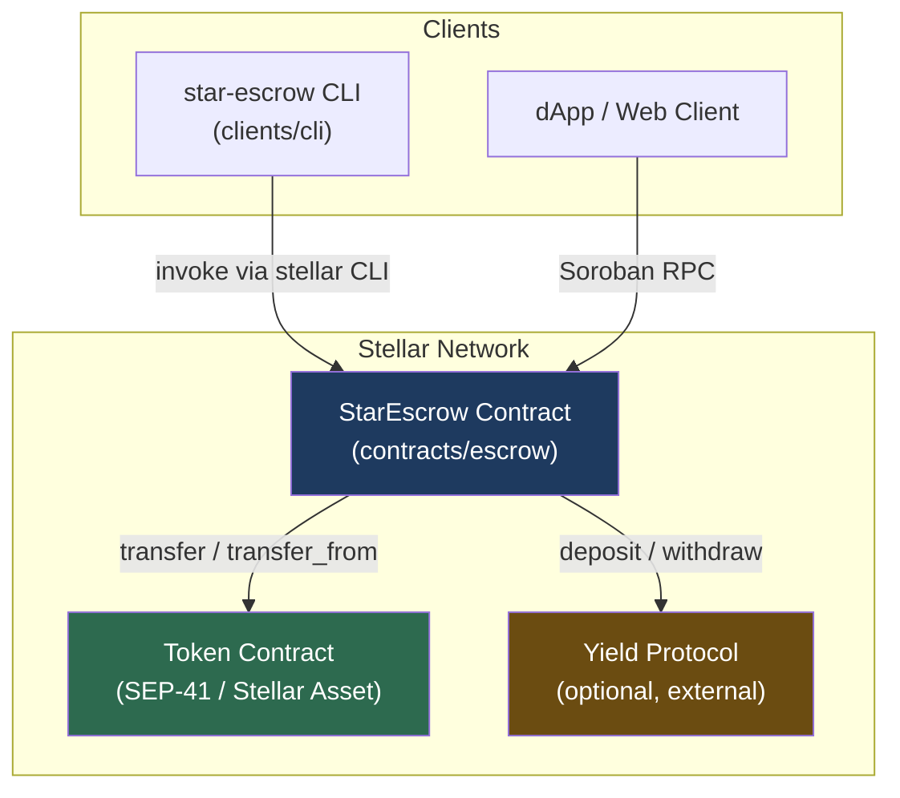
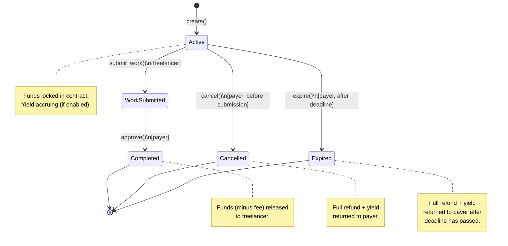
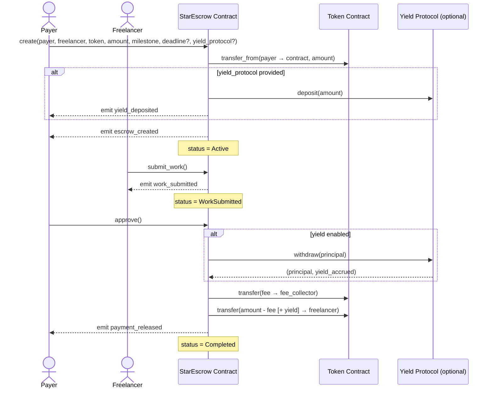
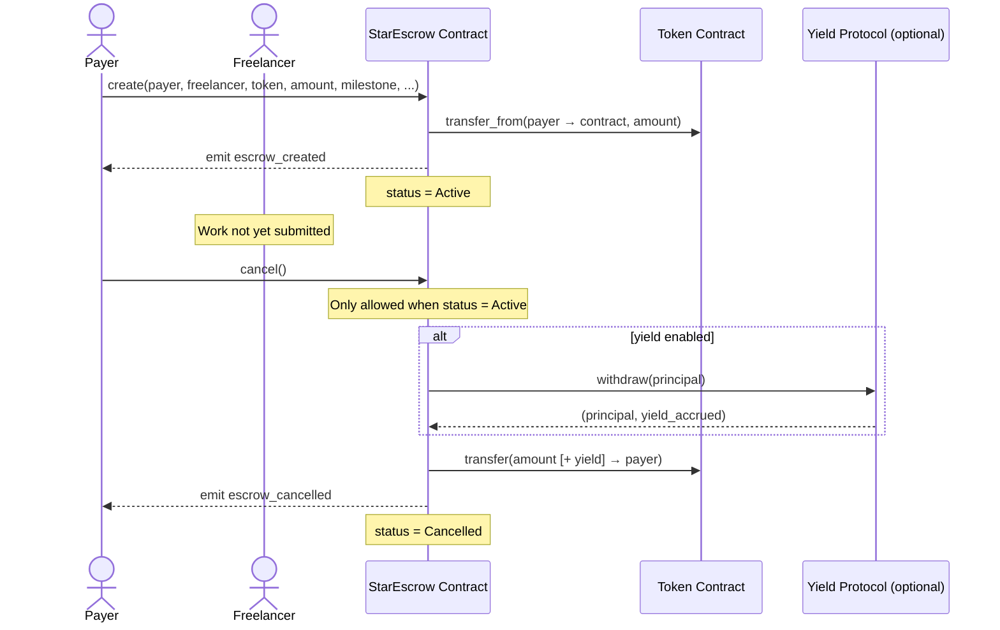
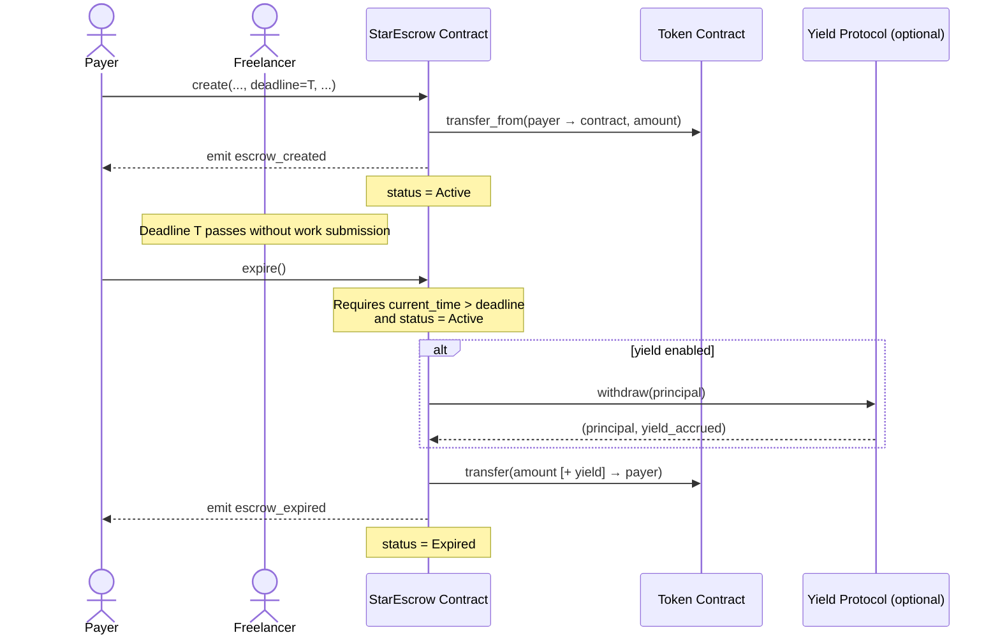

# StarEscrow

Programmable escrow protocol for freelance and marketplace payments on Stellar using Soroban smart contracts.

## Architecture

### Component Diagram



### State Machine



---

## Sequence Diagrams

### Happy Path



### Cancel Flow



### Expire Flow



---

## Documentation

- [Protocol Specification](docs/PROTOCOL.md) — States, transitions, functions, events, and security model
- [Deployment Guide](docs/DEPLOYMENT.md) — Build, deploy to testnet and mainnet, post-deployment checks
- [Roadmap](docs/ROADMAP.md) — Planned features and milestones

---

## Quick Start

### Prerequisites

- [Rust](https://www.rust-lang.org/tools/install) with `wasm32-unknown-unknown` target
- [Stellar CLI](https://developers.stellar.org/docs/tools/developer-tools/cli/stellar-cli) (`stellar`)

### Build

```bash
stellar contract build
```

### Test

```bash
cargo test -p escrow
```

### Deploy

See [docs/DEPLOYMENT.md](docs/DEPLOYMENT.md) for full instructions.
